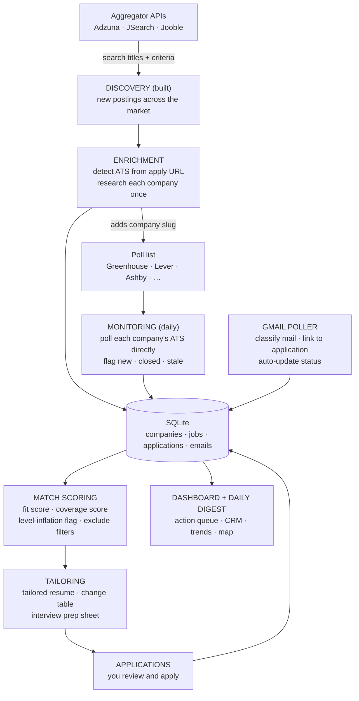

# Job Opportunity Tracker

An automated job search pipeline for software engineering roles. Today it discovers postings across the market from three job aggregators and stores them in one local database. The full design adds direct monitoring of company job boards, resume tailoring that never fabricates experience, application tracking from applied to offer, and a dashboard over all of it.

Built because the manual loop (search boards, read job descriptions, rewrite the resume, update a spreadsheet, chase email) does not scale, and the interesting parts of a job search are the decisions, not the data entry.

## Status

**Discovery works.** It queries Adzuna, JSearch, and Jooble, normalizes and dedupes the results, and writes them to SQLite. Every other layer is designed and specified in [docs/SPEC.md](docs/SPEC.md) but not built yet.

| # | Milestone | State |
|---|---|---|
| 1 | Discovery: three aggregator clients, normalization, dedupe on insert | Built |
| 2 | Tailoring: keyword engine, tailored resume, change table, prep sheet | Next |
| 3 | Monitoring: detect each company's ATS (applicant tracking system, the software it posts jobs through, such as Greenhouse or Workday) and poll it directly; closed-job detection | Planned |
| 4 | Match scoring and the "apply first" queue | Planned |
| 5 | Gmail: mail classification, status linking, action queue | Planned |
| 6 | Enrichment: per-company research cache | Planned |
| 7 | Dashboard and morning digest | Planned, last on purpose: data first |

The build order is compressed for time to first application: get real postings flowing and applications out the door, then layer monitoring, email, and UI behind them.

## How it works

The diagram is the complete design. Only discovery runs today, and it writes straight to SQLite; enrichment will sit between them.



**Discovery (built).** Aggregator APIs search the whole market by title and location, which solves the "companies I don't know exist" problem. JSearch adds Google for Jobs listings, which can include enterprise career sites on Workday and iCIMS, though most of its apply links point to job boards such as LinkedIn.

**Enrichment (planned).** Each posting's apply URL identifies the company's ATS: Greenhouse, Lever, Ashby, SmartRecruiters, Workable, or Recruitee, with Workday and iCIMS as a fragile second tier. The URL also yields the company's board slug, its ID on that ATS (`acme` in `boards.greenhouse.io/acme`), so the poll list grows itself from search results. Per-company research (industry, size, culture links) runs once and is cached.

**Monitoring (planned).** Daily polls of every discovered company's public ATS endpoint catch postings at the source instead of days later through aggregators. Seen-ID diffing means only new jobs flow downstream. Postings that disappear are marked closed, which also yields time-to-fill data per company, and postings open far too long get a stale flag with a stated reason.

**Match scoring (planned).** Every posting gets a fit score (level fit, stack overlap, salary floor, remote preference) and a coverage score, the share of the job description's weighted keywords the resume already covers. The queue then sorts by "apply first", not "newest".

**Tailoring (next).** For each job you greenlight, the engine extracts job description keywords weighted by importance (title over requirements over nice-to-haves) and matches them against the base resume with synonym detection. It then rewrites true experience in the job description's vocabulary, under a hard rule against fabrication. The output is the tailored resume plus a change table (keyword, importance, present before, what changed, where, why) that doubles as an interview prep sheet.

**Gmail integration (planned).** Read-only OAuth access scoped to one job label. It classifies mail (confirmation, rejection, interview invite, scheduling, recruiter outreach, offer), links messages to applications by sender domain, and feeds a prioritized action queue: time-sensitive first, aging unanswered second, new inbound third.

**Dashboard (planned).** A filterable view of every job and application: company, posted date, level, specialty, stack, work mode, location, salary, match score, status, interviews, contacts, and exactly which resume version was sent.

Other planned features, none built yet:

- Fuzzy dedupe behind the exact dedupe key, to catch the same job worded differently across sources
- Resume version archival: the exact file sent with each application, retrievable when the interview lands
- Direct-hire vs. staffing-agency detection, with agency reposts collapsed into the direct posting
- Follow-up reminders: applied N days ago, silence since
- Morning digest: new matches, status changes, today's action queue
- Multiple job-seeker profiles on one database

## What this deliberately does not do

- **No LinkedIn scraping or bot-detection evasion.** LinkedIn coverage will come from its own alert emails in the owner's inbox, plus read-only, human-paced capture from the owner's own logged-in browser.
- **No auto-submitted applications.** A human reviews and sends every application.
- **No fabricated resume content.** Tailoring rewords true experience into the job description's vocabulary, and the change table makes every edit auditable. [profile/skills-inventory.md](profile/skills-inventory.md) is the boundary of what may be claimed.

## Quick start

Requires Python 3.10 or newer. The commands are for PowerShell on Windows; the macOS and Linux equivalents are in the comments.

```powershell
git clone https://github.com/rainbow-unicorn-engineer/job-opportunity-tracker.git
cd job-opportunity-tracker
python -m venv .venv                          # macOS/Linux: python3 -m venv .venv
.venv\Scripts\Activate.ps1                    # macOS/Linux: source .venv/bin/activate
python -m pip install -r requirements.txt
Copy-Item config.example.yaml config.yaml     # macOS/Linux: cp config.example.yaml config.yaml
```

If PowerShell says running scripts is disabled, run `Set-ExecutionPolicy -Scope CurrentUser RemoteSigned` once and activate again.

Open `config.yaml`, set your titles and locations, and add keys for at least one source (see [API keys and free-tier limits](#api-keys-and-free-tier-limits) first: one source has a lifetime cap). Then run discovery from the repo root:

```powershell
python -m pipeline.discover
```

What to expect:

- **The run is quiet until it finishes.** It prints only failures while it works, then one summary line. With the example config that can mean over a hundred sequential requests.
- **Nothing is saved until every query is done.** An interrupted run loses its results, but the API calls it made still count against your quota.
- **The first run creates `jobtracker.db`** in the repo root. With the example config, expect a few thousand postings the first time and a handful of new ones on a same-day re-run.
- **With no keys filled in**, the run makes no calls and reports zero postings, without a warning.

The summary line looks like this:

```
fetched <n> postings | new <n> | cross-source dupes <n>
```

- **fetched** is every posting the sources returned this run.
- **new** is how many postings discovery inserted. It can slightly overcount, because a posting whose source ID is already stored under a different company, title, or city is ignored by the database but still counted.
- **cross-source dupes**, despite the label, counts every posting skipped because its dedupe key was already seen. That includes earlier runs, other sources, and the same source returning one posting for two overlapping queries, which is the most common case.
- Postings with no usable company name are dropped silently, so new plus dupes can be less than fetched.

A failed query prints one line and the run carries on. Adzuna and Jooble lines name the title and location; JSearch lines name its combined query:

```
[adzuna] 'Software Engineer'/'Dallas, TX' failed: <error>
[jsearch] 'Software Engineer in Dallas, TX' failed: <error>
```

**Failure lines can contain your API keys.** Adzuna and Jooble errors include the request URL, and that URL carries the key. Don't paste failure output anywhere public, and keep any log files out of git.

## API keys and free-tier limits

A source runs only when its key is filled in. Skipped sources print nothing.

| Source | Get a key at | Fields in `config.yaml` | What it adds |
|---|---|---|---|
| Adzuna | [developer.adzuna.com](https://developer.adzuna.com) | `sources.adzuna.app_id` and `sources.adzuna.app_key` | Broad US coverage. Nearly every posting has a salary, but most are Adzuna's own single-figure estimates, not employer-stated ranges |
| JSearch | [app.openwebninja.com/api/jsearch](https://app.openwebninja.com/api/jsearch) | `sources.jsearch.api_key` | Google for Jobs listings with full job descriptions, limited to the past week |
| Jooble | [jooble.org/api/about](https://jooble.org/api/about) | `sources.jooble.api_key` | More US listings. A jooble.org key covers US jobs only |

- **Adzuna needs both fields.** Discovery checks only `app_id`, so with `app_key` blank every Adzuna query is still sent and fails.
- **JSearch is called through OpenWebNinja's own API** (`api.openwebninja.com`, key in the `X-API-Key` header), not the RapidAPI marketplace, so use an OpenWebNinja key. Put it in `api_key`. A config that used the older `rapidapi_key` field should rename it.
- **Keys stay local.** `config.yaml` is gitignored. Never put keys in `config.example.yaml`, which is committed.

Each run sends one query per title per location to every enabled source. The titles are `titles_preferred` plus `titles_acceptable`. The example config has 17 titles and 2 locations, so each source gets 34 queries per run. Free-tier limits as published by each provider in September 2026:

| Source | Free-tier limit | Requests per run, example config | Runs that allows |
|---|---|---|---|
| Adzuna | 25 a minute, 250 a day, 1,000 a week, 2,500 a month | Up to 68 | About 3 a day or 14 a week |
| JSearch | 200 a month, hard limit | 34 | About 5 a month |
| Jooble | **500 per key, lifetime**, not per month | 34 | About 14, ever |

Adzuna asks for 2 pages of 50 results per query and skips page 2 only when page 1 is empty, so expect close to 68. JSearch and Jooble ask for one page per query.

Discovery has no quota guard, run cadence, or request throttling yet. An unthrottled run can also trip Adzuna's 25-per-minute limit. Until those exist, trim the title list to what you need, and leave a source's key blank to pause it. Don't put a free Jooble key on a daily schedule: it would run out within a couple of weeks and cannot be refilled.

## Configuration

`config.example.yaml` holds the full set of fields. Discovery reads only these today:

| Field | Effect |
|---|---|
| `search.titles_preferred` | Query terms |
| `search.titles_acceptable` | Query terms too; match scoring will rank them below preferred titles once it ships |
| `search.locations` | One query per location. An empty string `""` means no location filter: a nationwide search across every work mode, not a remote-only search. An empty list runs no queries |
| `sources.*` | API keys; see the section above |

The remaining fields (`levels`, `work_modes`, `relocation`, `relocation_scope`, `salary_floor`, `salary_target`, `exclude`, `titles_excluded`, `polling`, `gmail`) are placeholders for the scoring, monitoring, and Gmail layers and have no effect yet. Discovery applies none of your criteria, so contract roles and roles below the salary floor are stored. Filtering will happen in match scoring.

## What a discovery run does

1. **Builds the query list:** every title crossed with every location.
2. **Calls each enabled source**, one query at a time. A failed query is reported and its results are dropped. For Adzuna, a failure on page 2 also discards page 1.
3. **Normalizes** each result into one shape: company, title, location, work mode, salary, posted date, apply URL, and description. Jooble's salary text isn't parsed yet, so Jooble postings have no salary. Only JSearch filters by posting age; Adzuna and Jooble return older postings too.
4. **Parses signals** from the title and description:
   - **Level** (intern, junior, mid, senior, staff, principal) from title keywords such as "II", "III", "Sr." and "Staff". A title with no level keyword, such as a plain "Software Engineer", stays `unknown`, and that is most postings.
   - **Specialty** (ai, fullstack, frontend, backend, platform, other) from the title.
   - **Work mode** (remote, hybrid, onsite, or unknown). Adzuna and Jooble look for keywords in the description text. JSearch uses only its remote flag, so its postings are either remote or unknown. Most postings end up unknown.
   - **Level-inflation flag.** `title-below-reqs` marks a junior, mid, or unlabeled title whose description mentions 5 or more years. `title-above-reqs` marks a senior or staff title that mentions 2 years or fewer, which is often a good target. Both flags use the largest "N years" figure anywhere in the text, so unrelated mentions such as "in business for 25 years" count. Adzuna returns only about 500 characters of each description and Jooble about 300. Only JSearch returns the full text, so Adzuna and Jooble postings get flagged far less reliably.
5. **Dedupes before insert.** The key is the normalized company, title, and city, where the city is the text before the first comma. "Acme Inc / Software Engineer / Dallas, TX" and "Acme / Software Engineer / Dallas, Texas" are stored once, and re-running is safe. The key is exact, so some duplicates get through. Adzuna often puts a neighborhood first ("Highland Park, Dallas") where Jooble writes "Dallas, TX", and the sources word remote locations differently. The reverse also happens: two separate openings with the same company, title, and city are stored as one.
6. **Writes** new companies and jobs to `jobtracker.db` after every query has finished.

## Looking at the results

There is no dashboard yet. Open `jobtracker.db` in any SQLite client, such as [DB Browser for SQLite](https://sqlitebrowser.org), or query it from Python. Run this from the repo root; the read-only connection can't create a stray empty database elsewhere:

```powershell
python -c "import sqlite3; c = sqlite3.connect('file:jobtracker.db?mode=ro', uri=True); print(c.execute('SELECT source, COUNT(*) FROM jobs GROUP BY source').fetchall())"
```

Two useful queries:

```sql
-- Most recently discovered roles at mid, senior, or unstated level.
-- 'unknown' means the title has no level keyword, which covers most plain
-- "Software Engineer" postings, so leaving it out hides most of the results.
SELECT j.first_seen_at, c.name AS company, j.title, j.location, j.work_mode,
       j.salary_min, j.salary_max, j.apply_url
FROM jobs j JOIN companies c ON c.id = j.company_id
WHERE j.level IN ('mid', 'senior', 'unknown')
ORDER BY j.first_seen_at DESC
LIMIT 50;

-- Senior titles with modest stated requirements
SELECT c.name AS company, j.title, j.location, j.apply_url
FROM jobs j JOIN companies c ON c.id = j.company_id
WHERE j.level_inflation_flag = 'title-above-reqs';
```

Discovery fills the `companies` and `jobs` tables and seeds one row in `profiles` (id 1, named in [pipeline/db.py](pipeline/db.py)) that every job belongs to. The `applications`, `resume_versions`, `emails`, `contacts`, and `events` tables are created empty for the layers still to come. The full schema is in the same file.

## Repository layout

```
pipeline/
  discover.py          Discovery entry point: python -m pipeline.discover
  db.py                SQLite schema for every layer, plus connection helpers
  normalize.py         Common posting shape, level/specialty/work-mode parsing, dedupe key
  sources/             One client per aggregator: adzuna.py, jsearch.py, jooble.py
docs/
  SPEC.md              Technical specification for all layers
  DESIGN.md            Frontend design system shared across the author's projects, including this dashboard
profile/
  search-criteria.md   The owner's search criteria; source of truth for config.yaml
  skills-inventory.md  What tailoring may and may not claim
  stories-bank.md      Work stories the interview prep sheets will draw on
config.example.yaml    Config template, committed, no keys
config.yaml            Your config and keys (gitignored)
jobtracker.db          The database, created on first run (gitignored)
```

`archive/resumes/` is also gitignored and reserved for the archive of resumes sent with each application. The `profile/` docs describe the owner's own search; replace them with yours if you adapt this for your own.

## Stack

- **Today:** Python 3.10+, `requests`, `PyYAML`, and SQLite from the standard library.
- **Planned:** public ATS posting APIs, the Gmail API with read-only OAuth, and the Claude API for job description analysis, email classification, and tailoring. The dashboard will be Vite, React, and TypeScript over a small FastAPI layer.
