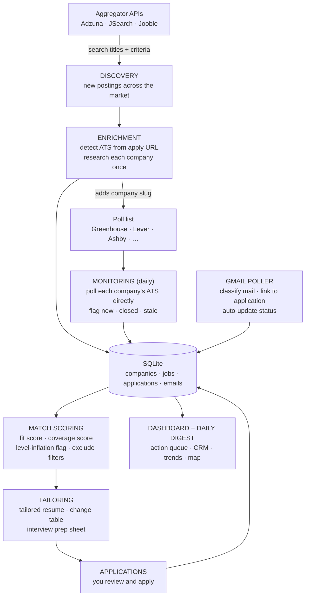

# Job Opportunity Tracker: Technical Specification

Status: scope locked. Five layers plus dashboard, seven enhancements folded in.
Build order compressed for time-to-first-application: Discovery → Tailoring → Monitoring / Gmail / Enrichment → Dashboard.

## 1. Goals and non-goals

**Goals**

- Automate discovery of software engineering roles across the whole market, including companies unknown to the user
- Monitor company ATS boards at the source for same-day visibility of new postings
- Tailor a resume per job description with maximum honest keyword overlap and a full audit trail of changes
- Track every application end to end: interest → applied → responses → interviews → offer
- Prioritize daily action: what to apply to, who to respond to, what is going stale

**Non-goals**

- LinkedIn scraping or any bot-detection evasion (LinkedIn coverage arrives via its alert emails, parsed from the user's own inbox)
- Auto-submitting applications
- Fabricating or inflating resume content

## 2. Architecture

Five pipeline layers over one SQLite database, plus a dashboard.



### Layer 1: Discovery

Search-first entry point. Queries aggregator APIs on a schedule with the user's criteria.

| Source | Access | Notes |
|---|---|---|
| Adzuna | free API key | broad board coverage, salary data |
| JSearch (OpenWebNinja) | free tier | wraps Google's job index; reaches Workday/iCIMS career sites via Google's crawl |
| Jooble | free API key | additional coverage |

Each result is normalized into a common posting shape: company, title, location, remote flag, salary if present, posted date, description, apply URL, source, source ID.

**Assisted LinkedIn capture (companion source).** LinkedIn coverage arrives two ways, neither of which scrapes: (1) LinkedIn job-alert emails parsed from the user's own inbox via the Gmail layer, and (2) Claude in Chrome sessions where the user's logged-in browser runs job searches, opens saved searches and postings at human pace, and captures details directly into the tracker. Read-only, low-volume, no auto-apply, no mass actions.

**Title preference tiers.** Config supports preferred vs acceptable titles (for example full stack and AI engineering preferred; frontend and backend acceptable). Acceptable-tier matches are captured and scored, not filtered out; the match score weights them below preferred-tier roles.

### Layer 2: Enrichment

Two responsibilities:

**ATS detection.** Parse each posting's apply URL against known domain patterns and extract the company board slug.

| ATS | URL pattern | Public endpoint | Tier |
|---|---|---|---|
| Greenhouse | boards.greenhouse.io/{slug} | boards-api.greenhouse.io/v1/boards/{slug}/jobs?content=true | 1 |
| Lever | jobs.lever.co/{slug} | api.lever.co/v0/postings/{slug}?mode=json | 1 |
| Ashby | jobs.ashbyhq.com/{slug} | api.ashbyhq.com/posting-api/job-board/{slug} | 1 |
| SmartRecruiters | careers.smartrecruiters.com/{slug} | api.smartrecruiters.com/v1/companies/{slug}/postings | 1 |
| Workable | apply.workable.com/{slug} | apply.workable.com/api/v3/accounts/{slug}/jobs | 1 |
| Recruitee | {slug}.recruitee.com | {slug}.recruitee.com/api/offers | 1 |
| Workday | {slug}.wd{n}.myworkdayjobs.com | internal cxs JSON endpoint (unofficial) | 2 |
| iCIMS | careers-{slug}.icims.com | portal JSON (inconsistent) | 2 |

Detected companies are added to the poll list automatically. Tier 2 pollers are isolated so a Workday format change cannot break the pipeline.

**Company research.** Once per company, cached: industry, approximate size, HQ, careers page, Glassdoor/Blind links, notes on equity/401k/AI-tooling mentions when stated in postings. Fields stay empty when the information is not stated; sparsity is honest.

**Direct-hire vs agency detection.** Classify each posting as direct or agency using a maintained staffing-firm list, JD phrasing ("our client," "confidential employer"), and unnamed employers. Agency postings are captured but deprioritized in scoring and visually flagged; duplicate agency reposts of a direct posting collapse into it.

### Layer 3: Monitoring

- Daily poll of every tier-1 company endpoint (tier 2 best-effort)
- Seen-ID diff per company: only new postings flow downstream
- Postings absent from the feed are marked `closed_at`, yielding per-company time-to-fill
- **Stale detection**: postings still listed but likely forgotten get a `stale_flag` with a stated reason. Heuristics: open past a threshold (default 45 days, configurable), open well past the company's own median time-to-fill once history exists, or repost-cycling (the same job disappearing and reappearing to look fresh). Stale is a flag surfaced to the user, never a silent filter; a stale posting at a high-interest company can still be worth a cheap application
- New postings matching the search criteria enter the match-scoring queue

### Layer 4: Tailoring

Runs on user greenlight per job.

1. **Keyword extraction.** Pull candidate terms from the JD. Weight by position: title > requirements > responsibilities > nice-to-have > boilerplate. Frequency and emphasis raise weight.
2. **Synonym matching.** Match JD terms against the base resume with an equivalence map (for example "CI/CD" ≈ "automated build and deployment", "observability" ≈ "monitoring/OTel"). Classify each keyword: present verbatim, present as synonym, genuinely absent.
3. **Rewrite.** Reword true experience into the JD's vocabulary. Hard rule: no new skills, no new responsibilities, no inflated claims. Genuinely absent keywords are never inserted; they are reported as gaps.
4. **Outputs.**
   - Tailored resume (docx), archived per application
   - Change table: keyword | importance (high/med/low + reason) | present before | what changed | where in resume | why
   - Interview prep sheet: the JD's vocabulary, the user's matching stories, and gap areas to prepare answers for

Level detection is weighted heavily in match scoring so mid-to-senior roles surface first.

**Implied-skills suggestions.** When a JD asks for a skill not in the inventory but demonstrably supported by the profile's stories and bullets (for example RBAC from the audit-logged admin dashboard, YAML from Prometheus configs), the engine proposes it as a suggestion with its evidence. Suggestions are never auto-added; the user approves each, and approved ones join skills-inventory.md.

**Fuzzy where it should be, exact where it must be.** Matching is fuzzy: the synonym map plus semantic judgment let "automated deployments" satisfy "CI/CD." Scores are honest approximations shown with their reasoning ("roughly 80% coverage," "strong fit"). Facts are never fuzzy: the engine may call Prometheus work "observability" but may never call it "Datadog." skills-inventory.md is the boundary.

**Scoring outputs per job:**

- **Fit score**: how well the role matches the profile (level fit, stack overlap, salary floor, remote preference)
- **Coverage score**: percentage of the JD's importance-weighted keywords present in the resume, computed before and after tailoring (the honest analog of LinkedIn's "top applicant" signal, which compares against other applicants and cannot be reproduced outside LinkedIn)
- **Level-inflation flag**: title level vs stated requirements mismatch in either direction (an "Engineer II" demanding 5+ years and three specialties, or a "Senior" role with modest requirements, which is a hidden good target)

### Layer 5: Gmail integration

- Read-only OAuth (gmail.readonly), scoped to a dedicated job label; a Gmail filter corrals ATS domains and applied-to company domains into that label
- Classification buckets: application confirmation, rejection, interview invite, scheduling request, recruiter outreach, offer, noise
- Messages link to application records by sender domain and thread history
- Status transitions update application records automatically ("heard back" fills itself in)
- Action queue priority:
  1. Action required and time-sensitive (scheduling, confirmations, offer deadlines)
  2. Waiting on user, sorted by age (staleness kills recruiter threads)
  3. New inbound opportunity
  4. FYI only, auto-logged
- Outbound follow-up reminders: applied N days ago with no response → suggest follow-up or LinkedIn touch
- The pipeline never sends email; it surfaces and prioritizes only

### Layer 6: Dashboard

- Local web UI over SQLite
- Filters on every captured field: company, posted date, level, specialty (backend/frontend/full stack/product/platform), stack, remote/hybrid/onsite, location, salary, match score, status
- Tracking per job: interested y/n, applied + date, resume version sent, responses, interview dates and contacts
- Company view: profile, open roles, hiring velocity, time-to-fill
- Morning digest (email or file): new matches, status changes, today's action queue

## 3. Cross-cutting features

| # | Feature | Lives in |
|---|---|---|
| 1 | Cross-aggregator dedupe: fuzzy match on normalized company + title + location before insert | pipeline core |
| 2 | Closed-job detection with time-to-fill stats | monitoring |
| 3 | Resume version archival: exact file per application | tailoring/applications |
| 4 | Match score: level fit, stack overlap, salary floor, remote preference | scoring queue |
| 5 | Outbound follow-up reminders | gmail/action queue |
| 6 | Interview prep sheet per job | tailoring |
| 7 | Daily digest | dashboard layer |

## 3.5 Analytics module (dashboard layer)

Market metrics computed from accumulated pipeline data. Numbers are a sample of the market (what the sources surface), not a census; trends are directional and require history, which accrues from the first day of polling.

- Open postings by category, specialty, and level (bar charts)
- Trend lines over time: which specialties and levels are growing or shrinking in the sample
- Per-company hiring velocity and time-to-fill
- Geographic cluster map of postings (geocoded location strings)
- Adzuna statistics endpoints (salary histograms, regional data) pulled directly where available

## 3.6 Multi-profile support

The system serves multiple job seekers from day one. A `profiles` table owns each user's base resume, search criteria config, synonym map, and skills inventory; jobs, applications, and emails hang off a profile. Profile 1: full stack / AI engineering roles. Profile 2 (queued): data and business analyst through principal analytics architect roles. Cloning a profile is configuration, not code.

## 4. Data model (SQLite)

```
profiles       id, name, base_resume_path, criteria_json,
               synonym_map_json, skills_inventory_json
companies      id, name, ats_type, ats_slug, industry, size, hq,
               careers_url, research_json, researched_at
jobs           id, company_id, source, source_id, dedupe_key, title,
               level, specialty, stack_json, location, work_mode,
               salary_min, salary_max, posted_at, first_seen_at,
               closed_at, apply_url, jd_text, match_score
applications   id, job_id, status, interested, applied_at,
               resume_version_id, notes
               -- status: saved | applied | screening | interviewing |
               --         offer | rejected | withdrawn | ghosted
               -- ghosted auto-sets after N days of silence post-apply
               --         (configurable, default 21)
resume_versions id, application_id, file_path, change_table_json,
               prep_sheet_path, created_at
emails         id, application_id, gmail_msg_id, thread_id, sender,
               classification, received_at, action_needed,
               responded_at
contacts       id, company_id, name, role, email, linkedin_url, notes
events         id, application_id, type (interview/screen/offer),
               scheduled_at, with_whom, outcome
```

Dedupe key: `normalize(company) + normalize(title) + normalize(location)` with fuzzy fallback (token-set ratio ≥ threshold) checked across sources before insert.

## 5. Configuration

```yaml
# config.yaml
search:
  titles: []          # e.g. Software Engineer, Full Stack Engineer, Backend Engineer,
                      #      AI Engineer, Applied AI Engineer, LLM/Agent Engineer
  levels: []          # e.g. II, Senior
  locations: []       # e.g. Dallas-Fort Worth, Remote (US)
  work_modes: []      # remote | hybrid | onsite
  salary_floor: null
  exclude: []         # e.g. contract, clearance-required
sources:
  adzuna: { app_id: "", app_key: "" }
  jsearch: { api_key: "" }
  jooble: { api_key: "" }
polling:
  aggregator_interval_hours: 24
  ats_interval_hours: 24
gmail:
  label: "JobSearch"
  enabled: false      # flips on when the layer ships
```

## 6. Milestones

| # | Milestone | Definition of done |
|---|---|---|
| 1 | Discovery MVP | criteria in config; Adzuna + JSearch clients; normalized postings landing in SQLite; dedupe on insert |
| 2 | Tailoring MVP | JD in → tailored docx + change table + prep sheet out; resume archival |
| 3 | Monitoring | ATS detection from apply URLs; tier-1 pollers; closed-job detection |
| 4 | Match scoring + queue | scored backlog ordered by "apply first" |
| 5 | Gmail layer | label polling, classification, status linking, action queue, follow-up reminders |
| 6 | Enrichment cache | per-company research, run-once semantics |
| 7 | Dashboard + digest | filterable UI over the DB; morning digest |

## 7. Open items

- Search criteria values (titles, level stance, locations, salary floor) pending from user
- Adzuna and OpenWebNinja keys pending
- Synonym/equivalence map seeded from the user's base resume vocabulary
- Digest delivery choice: email vs local file vs both
